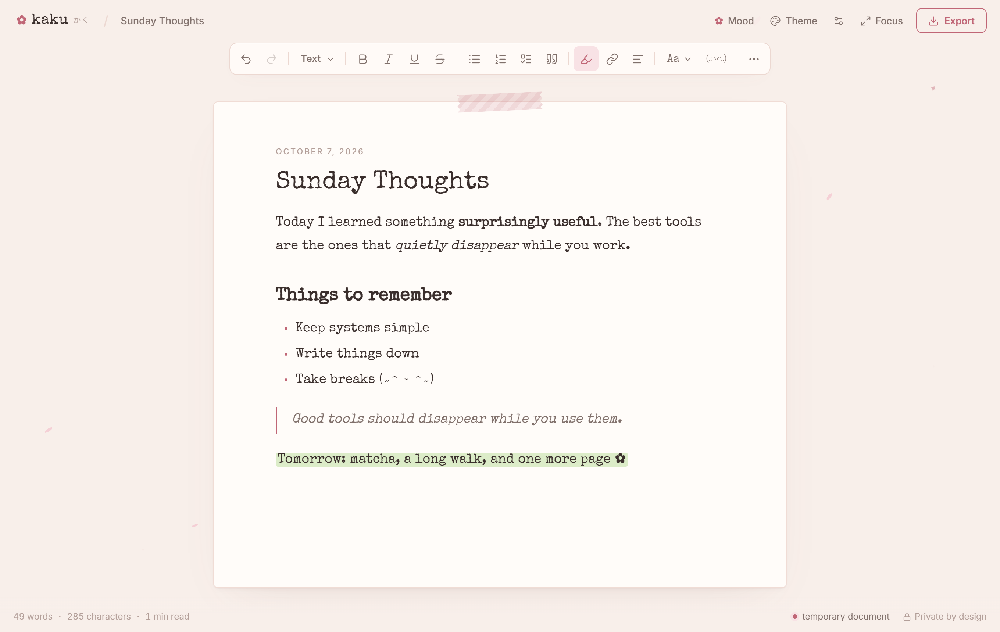

# ✿ Kaku

*write something beautiful.*



Kaku (書く, "to write") is a small, private writing room that lives entirely in your browser tab. It sits somewhere between a notepad, a minimal rich-text editor, Japanese stationery and a retro typewriter.

**Open → Write → Make it beautiful → Export → Leave.**

There are no accounts, no cloud and no saved documents. When the tab closes, the page is blank again. That's on purpose.

---

## Philosophy

- **Ephemeral by design.** Your document exists only in the tab's memory. Nothing is written to `localStorage`, `IndexedDB`, cookies or any server.
- **Writing first.** One continuous sheet of paper, a quiet toolbar, and decoration you can turn off.
- **Export, then go.** Markdown, plain text, HTML or PDF are generated in your browser and downloaded directly.

## Features

**Editor**
- Rich text built on Tiptap/ProseMirror: paragraphs, H1–H3, bold, italic, underline, strikethrough, inline code, code blocks, quotes, bullet/numbered lists, checklists, flower dividers, links, alignment, highlighter colours, ink colours and text sizes
- Floating toolbar on selection (bold, italic, underline, highlight, link)
- `/` slash menu for headings, lists, quotes, dividers and code
- Command palette (`Ctrl/⌘ K` with nothing selected, or `Ctrl/⌘ Shift P`)
- Markdown-style typing shortcuts (`# `, `- `, `1. `, `> `, `[ ] `, `---`)
- Editable title, used as the export filename

**Atmosphere**
- 8 themes: Typewriter, Sakura, Matcha, Seoul Morning, Peach Milk, Lavender Study, Tokyo Night and AR Console
- 9 curated fonts (Special Elite, Inter, Cormorant, Space Grotesk, JetBrains Mono, Noto Sans JP, Noto Sans KR, Nunito Sans and Future Console). Fonts are self-hosted and loaded only when you pick them
- Paper styles: plain, ruled, grid, dots and letter, plus optional paper grain
- ✿ Mood panel: sakura petals, soft sparkles, caret styles, kaomoji and stationery symbols
- Optional synthesised typewriter sounds (off by default, no audio files)

**Writing aids**
- Focus mode (`Ctrl/⌘ Shift F`), typewriter mode (keeps your line centred) and focus-current-paragraph
- Word goal with a thin progress bar and a small celebration when you reach it
- Writing timer (15 / 25 / 45 minutes or custom)
- Live word, character and reading-time counts, including Japanese and Korean text

**Export** (`Ctrl/⌘ Shift S`)

| Format | Notes |
| --- | --- |
| PDF / Print | Print stylesheet with only the title and document. Optional date, page numbers and paper style. Pick "Save as PDF" in the print dialog. |
| Markdown | Clean, readable CommonMark/GFM. No stray HTML. |
| Plain text | Formatting stripped, structure kept. |
| HTML | A standalone page with escaped content and a restrictive Content-Security-Policy. |
| Copy Markdown / Copy text | Straight to the clipboard. |

## Privacy

- **Documents are not uploaded.** There is no backend. The built site is static files only.
- **Documents are not persisted.** Your text exists only in memory. It is never written to `localStorage`, `sessionStorage`, `IndexedDB` or cookies. Preferences (theme, font and so on) also reset with the tab.
- **Documents disappear when the tab or session ends.** Refreshing, closing the tab or closing the browser clears everything. If there is text on the page, the browser asks you to confirm before you leave.
- **Export anything you want to keep.** Downloads are generated locally with `Blob` URLs.
- **No analytics, telemetry or trackers.** Fonts are bundled with the app (via Fontsource), so loading the page makes no third-party requests.

```text
User
 ↓
Browser tab
 ├── Editor state (memory only)
 ├── Formatting · Themes
 ├── Markdown / TXT / HTML generators
 └── Print / PDF view
 ↓
Downloaded file
```

## Tech stack

React 19 · TypeScript · Vite · Tiptap 3 (ProseMirror) · Tailwind CSS 4 · Lucide icons · Fontsource · Vitest · Playwright

## Getting started

Requires Node.js 20 or later.

```bash
# 1. Install dependencies
npm install

# 2. Run locally (http://localhost:5173)
npm run dev

# 3. Run the tests
npm test            # unit tests (exporters, word counts, file names, URLs)
npm run test:e2e    # browser tests: formatting, export, printing, and that
                    # nothing survives a reload or reaches browser storage
                    # (first time: npx playwright install chromium)

# 4. Build the static site into dist/
npm run build

# Preview the production build
npm run preview
```

## Deploying to GitHub Pages

The build uses relative asset paths (`base: './'`), so it works at any sub-path such as `https://username.github.io/project-name/` without changing anything.

1. Push this project to a GitHub repository with `main` as the default branch.
2. In the repository, open **Settings → Pages** and set **Source** to **GitHub Actions**.
3. Push to `main`, or run the workflow by hand from the **Actions** tab.

The workflow in [`.github/workflows/deploy.yml`](.github/workflows/deploy.yml) runs `npm ci`, the unit tests, `npm run build` and the browser tests, then publishes `dist/` to Pages. No server is needed after that.

> If you'd rather use absolute asset URLs, build with `BASE_PATH=/project-name/ npm run build`.

To rename the product, edit [`src/config/brand.ts`](src/config/brand.ts). It holds the name, wordmark, kana, logo glyph and tagline.

## Keyboard shortcuts

| Action | Shortcut |
| --- | --- |
| Bold / Italic / Underline | `Ctrl/⌘ B` / `I` / `U` |
| Strikethrough | `Ctrl/⌘ Shift X` |
| Highlight | `Ctrl/⌘ Shift H` |
| Link (with a selection) | `Ctrl/⌘ K` |
| Command palette | `Ctrl/⌘ K` (no selection) or `Ctrl/⌘ Shift P` |
| Undo / Redo | `Ctrl/⌘ Z` / `Ctrl/⌘ Shift Z` |
| Select all | `Ctrl/⌘ A` |
| Export menu | `Ctrl/⌘ Shift S` |
| Focus mode | `Ctrl/⌘ Shift F` |
| Print / PDF | `Ctrl/⌘ P` |
| Close menus, leave focus mode | `Esc` |

## Project structure

```text
src/
  app/          App shell, in-memory settings & UI state, commands, microcopy
  config/       Branding (name, wordmark, tagline)
  editor/       Tiptap setup, extensions, commands, slash menu, paper, editor CSS
  components/   Header, Toolbar, FloatingToolbar, LinkEditor, FontPicker,
                ThemePicker, MoodPanel, SettingsPanel, KaomojiPicker, ExportMenu,
                StatusBar, WritingGoal, WritingTimer, CommandPalette, SlashMenu,
                Atmosphere, PrivacyNotice, Toasts, ui/ (Popover, Tooltip, controls)
  export/       toMarkdown, toPlainText, toHtml, printDocument, format registry
  themes/       Theme tokens, theme list, ink & highlighter palettes
  fonts/        Curated font list with lazy loaders
  hooks/        beforeunload, timer, typewriter sound, exporter, media queries
  utils/        File names, downloads, clipboard, URLs, text stats, dates
  styles/       Global styles and the print stylesheet
e2e/            Playwright browser tests (desktop + mobile)
```

**Adding a theme:** append an entry to `THEMES` in [`src/themes/themes.ts`](src/themes/themes.ts). Every colour is a CSS variable token.
**Adding an export format:** add an entry to `FILE_FORMATS` in [`src/export/formats.ts`](src/export/formats.ts).

## Contributing

Issues and pull requests are welcome. Please keep the spirit of the project:

- No persistence, accounts, analytics or network calls involving document content.
- Keep decorative effects optional, CSS-driven and respectful of `prefers-reduced-motion`.
- Run `npm test` and `npm run test:e2e` before opening a PR.

## License

[MIT](LICENSE) © 2026 Sudhanshu Mukherjee. Bundled fonts are distributed under the SIL Open Font License 1.1 via [Fontsource](https://fontsource.org), and Lucide icons use the ISC License.
